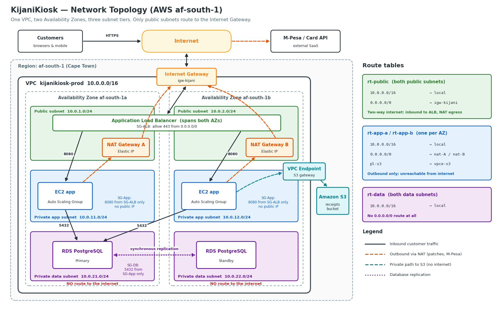

# Network Topology and Routing Logic



*Diagram source: [`diagram/render_topology.py`](diagram/render_topology.py) — regenerate with `python3 starter-kit/diagram/render_topology.py`.*

---

## The core idea

**A subnet is "public" or "private" because of its route table, not because of its name.** A subnet is public if and only if its route table sends `0.0.0.0/0` to an Internet Gateway. Everything else follows from that one rule.

We put *only* the components that must be reachable from the internet in public subnets — and that is just the load balancer and the NAT Gateways. No application server and no database is ever directly reachable.

---

## Address plan

VPC: **`10.0.0.0/16`** (65,536 addresses — far more than needed now, leaving room to grow without re-addressing)

| Tier | AZ-a (`af-south-1a`) | AZ-b (`af-south-1b`) | Reserved for AZ-c | What lives here |
|---|---|---|---|---|
| Public | `10.0.1.0/24` | `10.0.2.0/24` | `10.0.3.0/24` | Application Load Balancer, NAT Gateways |
| Private app | `10.0.11.0/24` | `10.0.12.0/24` | `10.0.13.0/24` | EC2 app servers (no public IPs) |
| Private data | `10.0.21.0/24` | `10.0.22.0/24` | `10.0.23.0/24` | RDS PostgreSQL primary and standby |

The numbering is deliberate: the tens digit is the tier (`0x` public, `1x` app, `2x` data) and the units digit is the AZ. Anyone reading a log line with `10.0.22.x` knows instantly it is a database in AZ-b.

> The brief asks for one public and one private subnet. We start from that pattern and apply it **per AZ**, and we split "private" into **app** and **data** tiers. Each extra subnet exists for a reason: one per AZ for reliability (see `regions-azs.md`), and a separate data tier so the database can have *no* internet path at all.

---

## Route tables

### `rt-public` — associated with both public subnets

| Destination | Target | Meaning |
|---|---|---|
| `10.0.0.0/16` | local | Reach anything else inside the VPC |
| `0.0.0.0/0` | `igw-kijani` | Everything else goes to the internet, **and** the internet can reach resources here that have public IPs |

This is the **only** route table in the VPC with an Internet Gateway route.

### `rt-app-a` and `rt-app-b` — one per AZ

| Destination | Target | Meaning |
|---|---|---|
| `10.0.0.0/16` | local | Reach the ALB and database |
| `0.0.0.0/0` | `nat-A` (in rt-app-a) / `nat-B` (in rt-app-b) | Outbound-only internet via the NAT in the **same** AZ |
| S3 prefix list | `vpce-s3` | Reach S3 privately, without touching the internet or the NAT |

**Why a NAT and not the IGW?** App servers must *call out* — to the M-Pesa API, to download OS security patches — but nothing on the internet should be able to *call in*. A NAT Gateway allows connections the server starts and drops unsolicited inbound ones. So the app tier has **internet access but no internet exposure**. It has no route to the IGW and its instances have no public IPs, so it meets the requirement that only the public subnet has internet routing.

**Why two app route tables?** Each points at the NAT in its own AZ. If AZ-a fails, AZ-b's servers keep outbound access through NAT-B. A single shared table pointing at one NAT would make that NAT a hidden single point of failure.

**Why the S3 endpoint?** Receipts are uploaded to S3. Without the endpoint that traffic would go out through the NAT (costing money per GB) and over the public internet. The gateway endpoint keeps it on AWS's private network — and the bucket policy only accepts the app role's requests if they arrive through this endpoint (see `iam-least-privilege.md`).

### `rt-data` — associated with both data subnets

| Destination | Target | Meaning |
|---|---|---|
| `10.0.0.0/16` | local | Talk to the app tier and replicate to the standby |

**No `0.0.0.0/0` route at all.** The database cannot reach the internet and the internet cannot reach the database, even if a security group were misconfigured. RDS is a managed service, so AWS patches it through its own management plane; our database never needs outbound internet.

---

## How traffic actually flows

**1. A customer places an order (inbound)**
```
Customer ──HTTPS 443──▶ Internet ──▶ IGW ──▶ ALB (public subnets)
                                              │ 8080
                                              ▼
                                    EC2 app (private app subnet)
                                              │ 5432
                                              ▼
                                    RDS primary (private data subnet)
```

**2. The app confirms payment with M-Pesa (outbound)**
```
EC2 app-a ──▶ rt-app-a: 0.0.0.0/0 → NAT-A ──▶ rt-public: 0.0.0.0/0 → IGW ──▶ M-Pesa API
   (responses return along the same path; M-Pesa cannot open a new connection to EC2)
```
M-Pesa's callback — the confirmation it sends after the customer approves — arrives as a normal inbound HTTPS request to the **ALB**, just like a customer request, on a dedicated callback path.

**3. The app stores a receipt (private)**
```
EC2 app ──▶ rt-app-*: S3 prefix list → vpce-s3 ──▶ S3 receipts bucket
```

---

## Security groups — the second layer

Route tables decide *where packets can go*. Security groups decide *which connections each resource accepts*. They reference each other instead of IP ranges, so rules stay correct as instances come and go.

| Security group | Inbound allowed | From |
|---|---|---|
| `sg-alb` | TCP 443 (and 80, redirected to 443) | `0.0.0.0/0` |
| `sg-app` | TCP 8080 | `sg-alb` only |
| `sg-db` | TCP 5432 | `sg-app` only |

The result is a strict chain: **internet → ALB → app → database**. No tier can be skipped. Even another resource inside the VPC cannot reach the database unless it is in `sg-app`.

**Admin access:** there is no SSH port open anywhere and no bastion host. Engineers reach servers through AWS Systems Manager Session Manager, which is logged and needs IAM permission rather than an open port.

---

## Review checklist for any future network change

1. Does any route table other than `rt-public` have a route to the IGW? → **must be no**
2. Does any EC2 instance or RDS database have a public IP? → **must be no**
3. Does `rt-data` have any `0.0.0.0/0` route? → **must be no**
4. Does each private app subnet route through the NAT in its **own** AZ? → **must be yes**
5. Does any security group allow `0.0.0.0/0` other than `sg-alb`? → **must be no**
